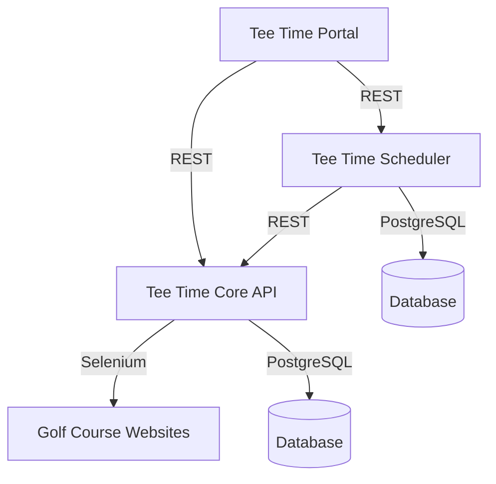

# Golf Booking Platform
## Overview

The Golf Booking Platform is an automated tee time reservation system designed to help golfers secure highly competitive tee times at popular golf courses. The platform handles the entire booking process from user registration to automated booking execution at precisely the right moment when tee times become available.

### Key Features
- 🏌️ Automated tee time booking at exact release times
- 🕒 Smart scheduling system with retry capabilities
- 📱 Modern, responsive web interface
- 🔐 Secure user authentication and authorization
- 📊 Booking analytics and success rate tracking
- 📧 Real-time booking notifications

## System Architecture



### Services

The platform consists of three main services:

1. **Tee Time Core API**
   - Java Spring Boot application
   - Handles user management and direct bookings
   - Implements Selenium-based booking automation
   
2. **Tee Time Scheduler**
   - Spring-based scheduling service
   - Manages automated booking attempts
   - Provides retry and monitoring capabilities

3. **Tee Time Portal**
   - React-based web application
   - Modern, responsive user interface
   - Real-time booking status updates

## Quick Start

### Prerequisites
- Java 17+
- Node.js 18+
- PostgreSQL 14+
- Supabase
- Docker (optional)

### Local Development Setup
```bash
# Clone the repository
git clone https://github.com/your-org/golf-booking.git

# Start databases
docker-compose up -d postgres # using supabase so no need to start postgres

# Start Core API
cd tee-time-core
./mvnw spring-boot:run

# Start Scheduler
cd ../tee-time-scheduler
./mvnw spring-boot:run

# Start Portal
cd ../tee-time-portal
npm install
npm run dev
```

## Tee Time Core

The Tee Time Core API allows users to manage tee time reservations with functionalities to register, log in, make bookings, and manage existing reservations.

### Tech Stack

The Tee Time Core service is a Java Springboot application using the Spring framework. It will leverage selenium for webscraping and is built as a multi-module maven project.

### API Endpoints

#### User Management

##### Register a New User
**Endpoint:** `POST /register`  
**Description:** Register a new user by providing their details.

**Request Body:**
```json
{
   "username": "string",
   "password": "string",
   "email": "string",
   "golfNZMemberId": "string",
   "golfNZPassword": "string"
   
}
```

**Responses:**
- 201: User successfully created
- 400: Invalid input
- 401: Unauthorized, invalid token
- 409: User already exists
- 500: Internal server error

##### Log In
**Endpoint:** `POST /login`  
**Description:** Log in a user with their credentials.

**Request Body:**
```json
{
  "username": "string",
  "password": "string"
}
```

**Responses:**
- 200: User successfully logged in
- 400: Invalid input
- 401: Unauthorized, invalid credentials
- 500: Internal server error

##### Log Out
**Endpoint:** `POST /logout`  
**Description:** Logs out the currently authenticated user session.

**Responses:**
- 200: User successfully logged out
- 401: Unauthorized, invalid token
- 500: Internal server error

#### Booking Management

##### Create a New Booking
**Endpoint:** `POST /makeBooking`  
**Description:** Create a new tee time booking.

**Request Body:**
```json
{
  "date": "YYYY-MM-DD",
  "time": "HH:MM",
  "course": "string",
  "players": "integer"
}
```

**Responses:**
- 201: Booking successfully created
- 400: Invalid input
- 401: Unauthorized, invalid token
- 500: Internal server error

##### Get All Bookings
**Endpoint:** `GET /getBookings`  
**Description:** Retrieve all bookings for the current user.

**Responses:**
- 200: List of bookings successfully retrieved
- 401: Unauthorized, invalid token
- 500: Internal server error

##### Modify an Existing Booking
**Endpoint:** `PUT /modifyBooking`  
**Description:** Update details of an existing booking.

**Request Body:**
```json
{
  "date": "YYYY-MM-DD",
  "time": "HH:MM",
  "course": "string",
  "players": "integer"
}
```

**Responses:**
- 200: Booking successfully modified
- 400: Invalid input
- 401: Unauthorized, invalid token
- 500: Internal server error

##### Delete a Booking
**Endpoint:** `DELETE /deleteBooking`  
**Description:** Delete an existing booking.

**Request Body:**
```json
{
  "date": "YYYY-MM-DD",
  "time": "HH:MM",
  "course": "string",
  "players": "integer"
}
```

**Responses:**
- 200: Booking successfully deleted
- 400: Invalid input
- 401: Unauthorized, invalid token
- 500: Internal server error

### Error Handling

The API uses the following error structure for all unexpected conditions:

```json
{
  "code": "integer",
  "message": "string"
}
```

## Tee Time Scheduler Service

### Overview
The Tee Time Scheduler Service is a Spring-based scheduling service that executes booking requests through the Tee Time Core API at precise times. This service is designed to handle automated booking attempts when courses release their tee times, ensuring the best possible chance of securing desired tee times.

### Key Components


### Error Handling

The scheduler implements the following error handling strategies:
1. Retry logic for failed API calls
2. Logging of all attempts and responses
3. Status tracking for each booking attempt
4. User notifications for both success and failure cases

### Monitoring

The service tracks:
- Number of scheduled bookings
- Success/failure rates
- API response times
- Retry attempts
- System performance metrics

This design provides a focused solution for executing API calls at specific times while maintaining reliability and monitoring capabilities.

[Previous API and Scheduler Documentation Remains The Same...]

## Tee Time Portal

### Overview
The Tee Time Portal is a React-based web application that provides users with a modern interface to interact with the Tee Time booking platform. It integrates with both the Core API and Scheduler Service to provide a seamless booking experience.

### Technology Stack
- **Framework:** React 18
- **Build Tool:** Vite
- **State Management:** Redux Toolkit
- **Styling:** Tailwind CSS
- **Component Library:** shadcn/ui
- **Type Safety:** TypeScript
- **Testing:** Vitest + React Testing Library
- **API Client:** Axios
- **Form Handling:** React Hook Form + Zod

### Project Structure
```
src/
├── components/
│   ├── common/
│   │   ├── Button/
│   │   ├── Card/
│   │   ├── Input/
│   │   └── Layout/
│   ├── booking/
│   │   ├── BookingCalendar/
│   │   ├── CourseSelector/
│   │   ├── PlayerSelector/
│   │   └── TimeSelector/
│   └── scheduler/
│       ├── ScheduleForm/
│       └── ScheduleList/
├── features/
│   ├── auth/
│   ├── booking/
│   └── scheduler/
├── hooks/
├── services/
│   ├── api/
│   └── scheduler/
├── store/
├── types/
└── utils/
```

### Key Features

#### Authentication & User Management
- Secure login/registration flow
- JWT token management
- Remember me functionality
- Password reset flow
- Profile management

#### Booking Interface
- Interactive calendar for date selection
- Real-time course availability checking
- Player count selection
- Time slot visualization
- Booking confirmation flow

#### Scheduler Management
- Schedule future booking attempts
- View scheduled booking status
- Cancel scheduled bookings
- Booking attempt history
- Success/failure notifications

#### Course Management
- Course information display
- Favorite courses
- Course release time information
- Historical booking success rates


### Development Setup

#### Prerequisites
- Node.js 18+
- npm or yarn
- Git

#### Installation
```bash
# Clone the repository
git clone https://github.com/your-org/tee-time-platform.git

# Navigate to frontend directory
cd tee-time-platform/frontend

# Install dependencies
npm install

# Start development server
npm run dev
```

#### Available Scripts
```json
{
  "scripts": {
    "dev": "vite",
    "build": "tsc && vite build",
    "test": "vitest",
    "test:coverage": "vitest run --coverage",
    "lint": "eslint src --ext .ts,.tsx",
    "format": "prettier --write \"src/**/*.{ts,tsx}\"",
    "storybook": "storybook dev -p 6006",
    "build-storybook": "storybook build"
  }
}
```

### Testing Strategy

#### Unit Testing
- Components tested in isolation
- Redux reducers and actions
- Utility functions
- Custom hooks

#### Integration Testing
- User flows
- API integration
- State management integration

#### E2E Testing
- Critical user journeys
- Cross-browser compatibility
- Mobile responsiveness

## Build & Deployment

### Build Process
1. Type checking (TypeScript)
2. Lint checking
3. Test execution
4. Asset optimization
5. Bundle generation

#### CI/CD Pipeline

The CI/CD pipeline is yet to be implemented.

The CI/CD pipeline is configured to automatically build and deploy the application on every commit to the main branch. The pipeline includes:
- Linting
- Unit tests
- Integration tests
- E2E tests
- Build artifacts generation
- Deployment to staging/production environments
- Monitoring and alerting

### Performance Optimization

- Code splitting
- Lazy loading of routes
- Image optimization
- Caching strategies
- Bundle size monitoring

### Accessibility

- WCAG 2.1 compliance
- Keyboard navigation
- Screen reader support
- Color contrast compliance
- Focus management

### Security Considerations

- CSRF protection
- XSS prevention
- Secure storage of sensitive data
- Input validation
- Authentication token management

This documentation provides a comprehensive overview of the Tee Time Portal frontend service. It covers the technical architecture, development workflow, and key considerations for building and maintaining the application.
